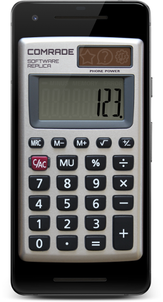

{:height="512px"}

# First of all
This is a calculator. It is free. No ads and no in-app purchases.

# Why yet another calculator app?
I tried many calculator apps, and I have to admit: an old pocket calculator is much more handy in everyday life.

It seems that the ancient art of building pocket calculators was lost somewhere inside gigahertz and gigabytes of modern mobile devices.

Yes, all these calculator apps can summarize, multiply and many many more, but do you remember that an old pocket 4-bit calculator could be used as a counter? Just press `1 + =` and get `2`, then press again `=` and get `3` and so on.

Or do you know that you can get a square number by pressing `× =`? So you don't need an X² button. And `3 × = =` will return `27`. That is 3³. And you do not need the X³ button either.

To change sign press `– =`. To get the result of 1/X operation press `÷ =`. Read more about these and other forgotten spells on [Tips & Tricks](tips-n-tricks/) page.

I like all these functions, and I want to see them in the mobile calculator app. Surprisingly I didn't find any similar app in Google Play. Do I have to do everything myself?

# What is this calculator?
This app is an emulator of an old pocket calculator. It uses my [open source project](https://github.com/DmitryDzz/calculator-comrade-lib) that emulates calculator's microprocessor architecture and algorithms. I found neither similar open projects nor detailed documentation, so this project is a consequence of my painstaking research and reverse engineering.

Since this is an emulator, I reproduced the design of my favorite CASIO HS-8VA pocket calculator as close as I could. In case modern software calculators don't have hardware buttons I had to add a vibration option to give the user some tactile feedback. Vibration option is the only unoriginal option in this software replica. I do not plan to add more functions in this calculator - that's the point of another app. On the other hand, I'd like to make this emulator as close to the original as possible, so feel free to [contact me](mailto:info@robot-mitya.ru) if you find any inaccuracies.

# Why is this app free?
1. There are thousands of calculators in Google Play market, so I have to find another way to become rich and rule the world. I can't take the money of all my three users.
1. I'm a hobbyist, and this project brings me a lot of fun. That's the price.
1. I dedicate this project to the pioneers who designed those ancient microprocessors. The deeper I dived in calculator's hardware, the more profound respect I fill to the developers.

 

